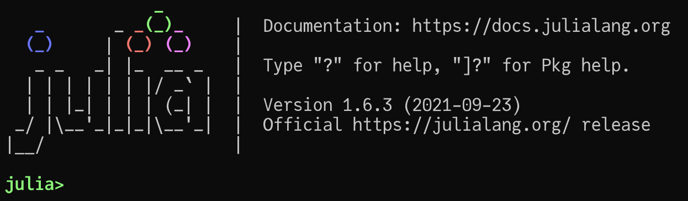

# 安装与配置 Julia 环境

（**仅限校园网**） 在校园网内部部署了一个 Jupyter 教学平台来使用 Julia， 具体的使用请[阅读文档][lflab-jupyter-docs]。

为了在自己的电脑或服务器上安装和 Julia， 你需要做以下几件事情：

- 安装 Julia 程序
- (可选） 配置 Julia 镜像
- 安装代码编辑器及其 Julia 插件： 这里推荐使用 VSCode
- (可选) 安装 Jupyter 或者 Pluto

## 安装 Julia 程序

> 我们这里说的 "Julia 程序" 是一个命令行程序。

前往 [Julia 下载页][julia-downloads] 或者 [BFSU镜像站][bfsu-julia-releases] 下载并安装**最新版本**的 Julia。 
在我组织这次讲座的时候最新版本是 1.6.3， 很快最新版就会来到 1.7.0. 姑且认为只要是最新的 1.y.z 版本， 
就能够成功运行这些材料里面的代码。
另外， 如果你是命令行用户的话， 可以直接使用 [jill.py](https://github.com/johnnychen94/jill.py) 来安装 Julia。

在成功安装之后， 你可以通过鼠标左键双击 Julia 程序来打开 Julia。 另一种方案是在命令行里执行`julia`，
不过这需要你先将 Julia 程序的路径 （安装目录下的 `bin` 文件夹) 添加到环境变量 `PATH` 中，
不同的操作系统和命令行有不同的配置方法， 关于这个网上能够找到各种各样的说明。 
成功打开 Julia 之后， 你应该能够看到以下的内容：



### Windows 相关的问题

- Julia 不支持 Windows 7， 请使用 Windows 10 及以上版本。
- 旧的 Powershell 版本也存在一些问题， 请使用 Powershell 7 及以上的版本。
- 杀毒软件（包括 Windows 自带的）会让 Julia 的装包过程变得异常缓慢， 你应该会想要将 Julia 或者 `*.toml` 文件添加到杀毒软件的白名单中。
- Julia 命令行下的色彩支持需要使用 [Windows Terminal](https://github.com/microsoft/terminal)。
- 很多 Windows 用户选择在 [WSL (Windows Subsystem for Linux)](https://docs.microsoft.com/en-us/windows/wsl/install) 下执行 Julia。


## 配置 Julia 镜像

更详细的内容可以参考阅读[Julia PkgServer 镜像服务及镜像站索引][julia-mirror-docs]. 这里仅仅介绍最简单的一种方案：
[PkgServerClient.jl]

```julia
pkg> add PkgServerClient # 按 ] 进入到 pkg 模式
```

安装完成后， 修改 `~/.julia/config/startup.jl` 文件 （首次使用的话，可能需要创建对应的文件夹）， 添加以下内容：

```julia
if VERSION >= v"1.4"
    try
        using PkgServerClient
    catch e
        @warn "error while importing PkgServerClient" e
    end
end
```

Julia 在每次启动的时候都会加载这个文件的内容 (除非以 `--startup=no` 模式启动)， 而当你加载 `PkgServerClient`
这个包的时候， 它会在后台自动切换到最近的镜像站。 例如：

```julia
julia> versioninfo()
Julia Version 1.6.3
Commit ae8452a9e0 (2021-09-23 17:34 UTC)
Platform Info:
  OS: macOS (x86_64-apple-darwin19.5.0)
  CPU: Intel(R) Core(TM) i9-9880H CPU @ 2.30GHz
  WORD_SIZE: 64
  LIBM: libopenlibm
  LLVM: libLLVM-11.0.1 (ORCJIT, skylake)
Environment:
  JULIA_PKG_SERVER = https://mirrors.bfsu.edu.cn/julia
```

当你看到 `JULIA_PKG_SERVER = <URL>` 的时候， 就说明已经成功配置好镜像了。

## 配置 VS Code

VS Code 是一个现代的、跨平台以及跨语言的开发环境， 有很多安装 VS Code 的办法，
比如说你可以跟随[官方安装指南](https://code.visualstudio.com/)来进行下载和安装。

打开 VS Code 后， 找到 VS Code 左侧的插件选项 ，
然后搜索 `Julia`， 然后安装 `Julia: Julia Language Support` 这个插件 （下载量最高的那个）。

如果你此前从来没有使用过 VS Code 的话， 你应该花一些时间阅读一下 [VS Code 文档](https://code.visualstudio.com/docs)
来了解它的功能。 在你熟悉 VS Code 自身后， 最好也再阅读一下 [Julia 插件文档](https://www.julia-vscode.org/) 的文档.

最后， 通过 [命令菜单 (Command Palette)](https://code.visualstudio.com/docs/getstarted/userinterface#_command-palette)
来可以打开 Julia。

- 在 VSCode 中通过 Ctrl-Shift-P (macOS 系统是 Cmd-Shift-P) 激活命令菜单：


- 然后选择 `Julia: Start REPL`， 确认之后， 你应该能够看到下方的 Terminal 部分开启了 Julia REPL， 这样一来， 就可以
  使用 Julia 正常工作了。

## 安装 Jupyter 或 Pluto

VSCode 是我最喜欢的 Julia 工作环境， 当然你也可以使用

- [IJulia.jl] 来安装 Jupyter 环境。 如果你用 Python 做深度学习的话， 那你一定接触过 Jupyter 了。
- [Pluto.jl] 来安装 Pluto 环境。 这是 Julia 社区最近一两年开发的一个 Jupyter 环境， 并受到很多人的喜爱。

这个系列讲座里的材料会使用 Jupyter 来做。

<!-- urls -->

[IJulia.jl]: https://github.com/JuliaLang/IJulia.jl
[Pluto.jl]: https://github.com/fonsp/Pluto.jl
[PkgServerClient.jl]: https://github.com/johnnychen94/PkgServerClient.jl
[julia-mirror-docs]: https://discourse.juliacn.com/t/topic/2969/53
[julia-downloads]: https://julialang.org/downloads/
[lflab-jupyter-docs]: http://docs.lflab.cn/#/user/server/jupyter
[bfsu-julia-releases]: https://mirrors.bfsu.edu.cn/julia-releases/bin/
